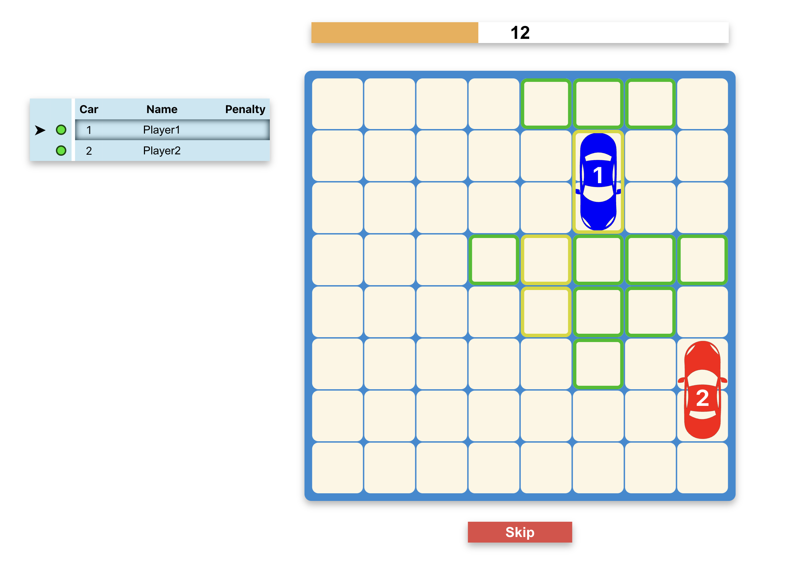

# Reparking Game v3.12.0


## Setting up and running DEV app
```
git clone https://github.com/keenethics/reparking_game.git
cd reparking_game
npm install
```
`.env.dev`
```
SERVER_PORT=
SERVER_CORS_ORIGIN=
REACT_APP_SERVER_URL=
REACT_APP_TELEGRAM_CHANNEL=
DISABLE_ESLINT_PLUGIN=true
```
```
npm run start:dev
```

## Setting up and running PROD app locally
```
git clone https://github.com/keenethics/reparking_game.git
cd reparking_game
npm install
```
`.env.prod`
```
SERVER_PORT=
REACT_APP_SERVER_URL=
REACT_APP_TELEGRAM_CHANNEL=
NODE_ENV=production
```
```
npm run build:prod-client
npm run start:prod-server
```


## Deploying to Fly
1. Install Flyctl
2. Log in to Fly
3. If `SERVER_URL` or `TELEGRAM_CHANNEL` changes, then update `Dockerfile`
4. Execute the command
```
npm run deploy
```


